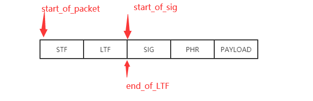
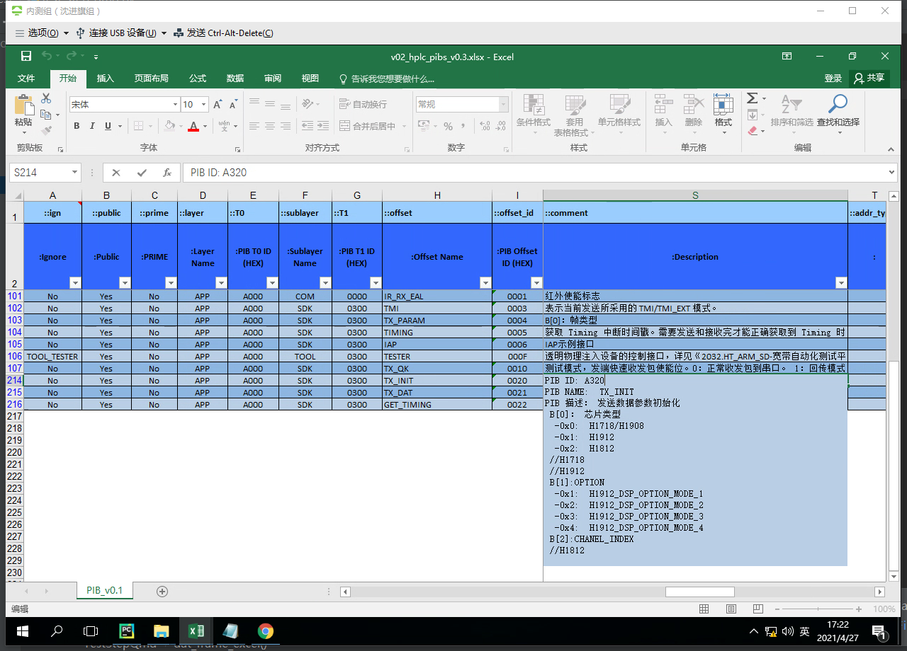
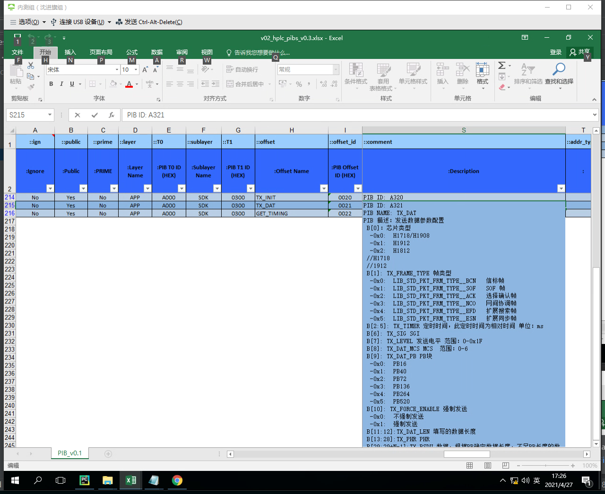
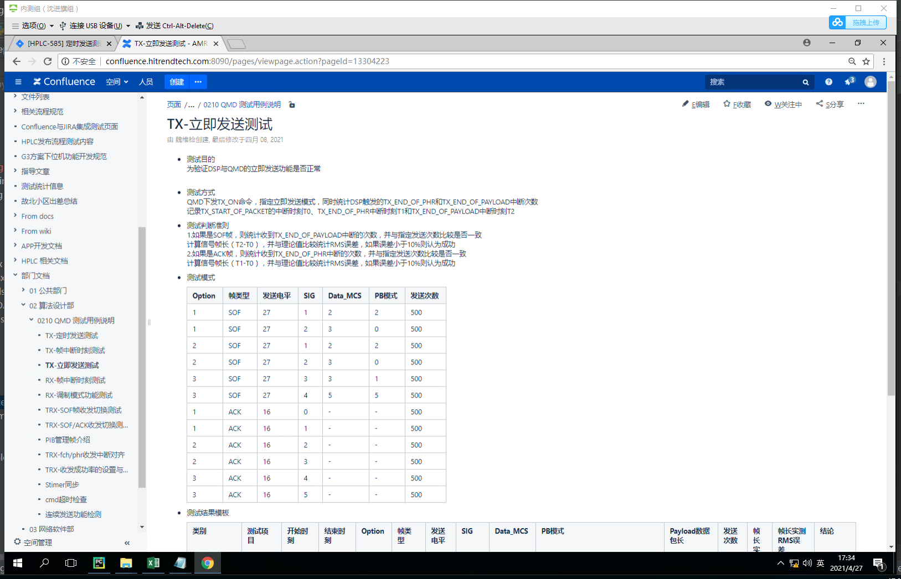
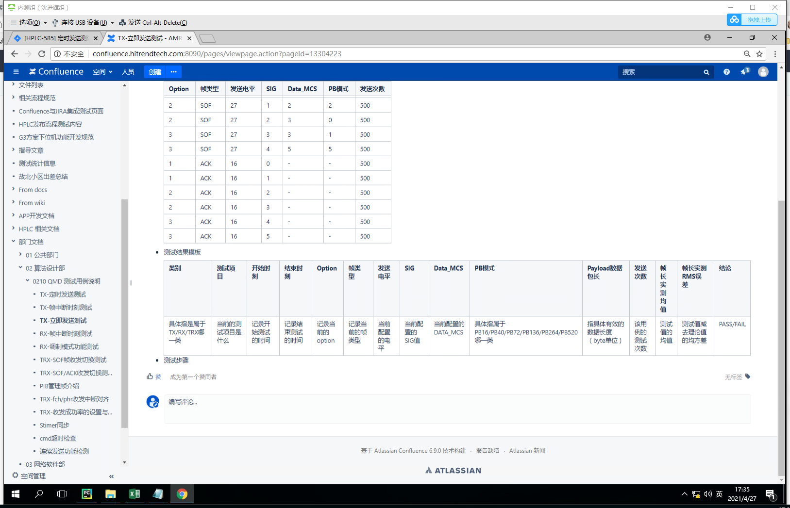
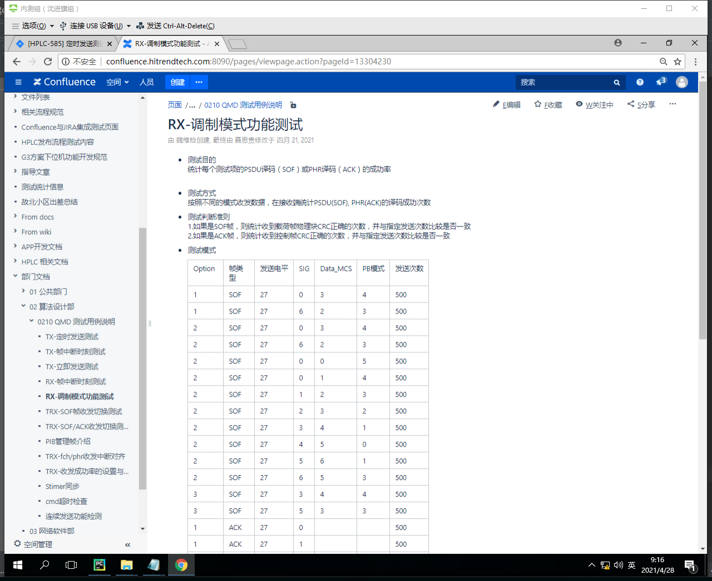
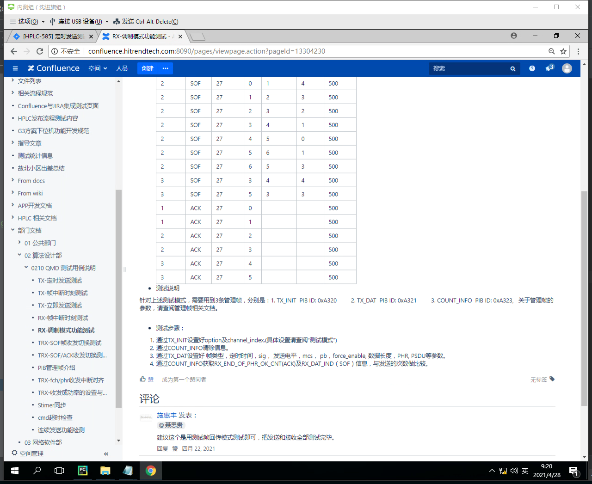

### qmd的说明文档

##### 理论值：

```bash
    # phr_mcs就是sig
    104 OPTION1
    52  OPTION2
    20  OPTION3
    
    STF+LTF+SIG+PHR+PAYLOAD
    
    TX_START_OF_PACKET --   TX_START_OF_SIG的长度   ->   STF+LTF
    
    TX_START_OF_SIG    --   TX_END_OF_PHR的长度     ->   SIG+PHR
    
    TX_END_OF_PHR      --   TX_END_OF_PAYLOAD的长度 ->   PAYLOAD
    
    
```


测试用例：





case_1, 定时发送测试

case_3, 立即发送测试send_test_now



case_5, 调制模式测试

